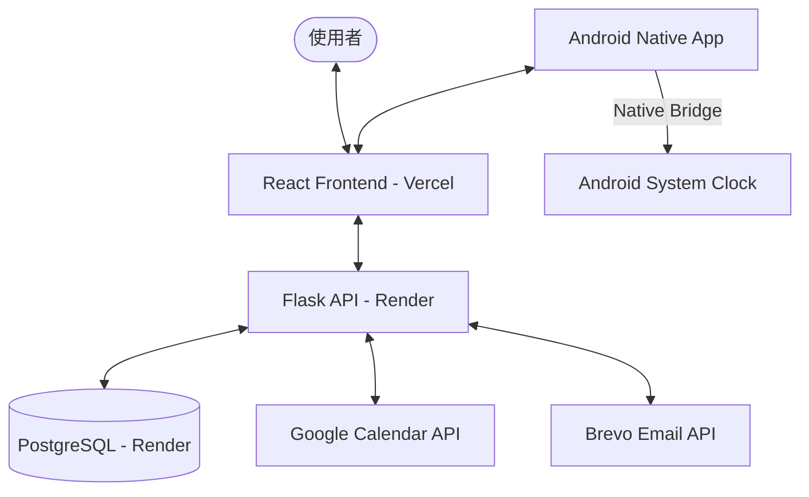

# TaskReminder 🔔

TaskReminder 是一款整合 Google 日曆雙向同步與 Android 原生系統通知的任務管理工具。旨在解決免費雲端環境下的通知延遲與系統限制，提供穩定的任務提醒體驗。

🌐 **線上體驗**：[https://task-reminder-omega-five.vercel.app](https://task-reminder-omega-five.vercel.app)  
📱 **Android 版下載**：[TaskFlow.apk](https://task-reminder-omega-five.vercel.app/TaskFlow.apk)

---

## 📐 系統架構



---

## 🚀 核心技術亮點

### 1. Android 原生鬧鐘橋接 (Native Bridge)
*   **挑戰**：Android 系統鬧鐘的 `SET_ALARM` Intent 要求「星期」參數 (`EXTRA_DAYS`) 必須為 `ArrayList<Integer>` 型別。然而，傳統網頁 Intent URI 僅能傳遞基礎型別，導致跨日提醒在原生層面失效。
*   **方案**：在 Android 原生層 `MainActivity.java` 實作指令攔截器。
*   **技術**：動態捕捉網頁端的 Intent 請求，在原生層進行型別轉換與包裝，成功實現網頁與手機系統鬧鐘的無縫精確同步。

### 2. 免費雲端環境下的郵件送達優化
*   **挑戰**：主流免費雲端平台 (如 Render) 為防範垃圾郵件，通常會封鎖標準 SMTP 通訊埠 (25/465/587)，導致傳統發信程式失效。
*   **方案**：捨棄 SMTP 協定，改採 **Brevo REST API** 封裝發信邏輯。
*   **技術**：透過 HTTP 通訊協定繞過通訊埠封鎖，顯著提升了在雲端限制環境下的郵件通知穩定性。

### 3. Google 日曆雙向同步機制
*   **挑戰**：確保第三方日曆與本地資料庫的一致性。
*   **方案**：實作 OAuth 2.0 授權流程與差異比對邏輯。
*   **技術**：整合 Google Calendar API，支援任務新增、編輯同步至雲端，並提供一鍵「同步更新」功能，將外部修改回流至本地。

---

## 🛠️ 技術棧

| 類別 | 技術 |
| :--- | :--- |
| **Frontend** | React 18, Vite 5, Lucide Icons, Vanilla CSS |
| **Backend** | Flask 3, SQLAlchemy, JWT-Extended |
| **Security** | OAuth 2.0, AES-GCM (Token 加密), API Rate Limiting |
| **Android** | Capacitor 5, Java (Native Bridge) |
| **Infrastructure** | Vercel, Render, PostgreSQL |

---

## 🚀 快速開始

### 環境變數配置
在伺服器端設定以下變數：
```env
SECRET_KEY=your_key
ENCRYPTION_KEY=your_base64_aes_key # 用於加密 Google Token
BREVO_API_KEY=xkeysib-your_api_key
GOOGLE_CLIENT_ID=your_id
GOOGLE_CLIENT_SECRET=your_secret
```

### 自動化部署
- 推送程式碼至 `main` 分支後，Vercel 與 Render 將透過配置檔案自動觸發建置流程。

---

## ⚠️ 已知限制與未來改進 (Future Improvements)

- **同步模式**：目前 Google 日曆同步採用 Polling (主動輪詢) 模式，未來計劃導入 Webhook 實現即時推送。
- **排程機制**：後端 APScheduler 目前運行於單一實例中，若擴展為分散式架構需改用 Redis 作為 Job Store。
- **Android 更新**：App 內更新目前為完整 APK 覆蓋，尚未支援差分更新 (Incremental Update)。
- **離線支援**：目前尚未完全實作 PWA 離線編輯功能。

---

## 📜 License
MIT License © 2026 TaskReminder Team
